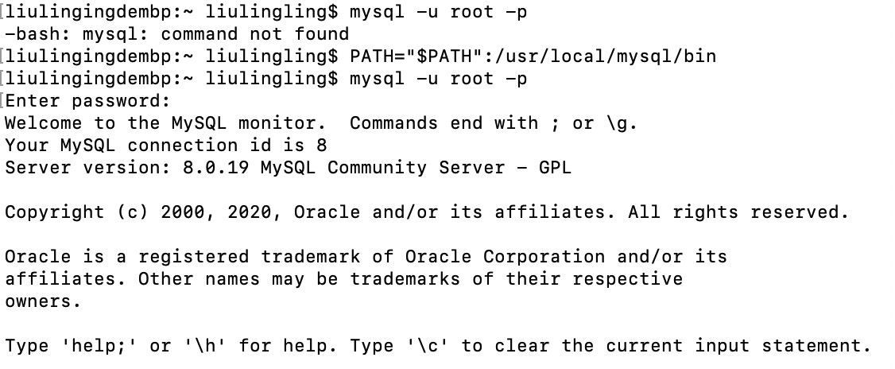

# MySQL的安装及简单使用测试

## 安装、启动及连接 MySQL

测试系统：macOS Catalina

1. 下载最新的[MySQL社区版](https://dev.mysql.com/downloads/mysql/)

2. 点击安装包开始安装

3. 在安装过程中设置 root 用户的密码

   

4. 点击系统偏好设置，可以发现底部多了一个 MySQL 图标

   

5. 点击该图表进入 MySQL 的设置界面，左边绿色圆点显示 MySQL 正在运行，可以通过红框内按钮关闭 MySQL

   

6. 打开终端添加系统环境变量，为连接 MySQL 做准备，代码如下：

   ```
   PATH="$PATH":/usr/local/mysql/bin
   ```

   然后通过以下命令登录 MySQL，密码为前面为 root 账户设置的密码：

   ```mysql
   mysql -u root -p
   ```

   登录成功

   

   如果还没有添加系统变量就想直接通过命令登录 MySQL，会出现上图第二行“command not found”的提示，所以添加系统变量是必须的。

## 简单使用测试

### 显示所有数据库

登录数据库命令上文已有提及，此处不在赘述。

输入 show databases 命令，显示所有数据库，注意语句需要以“;”或" \g "结尾：

```mysql
show databases;
```

显示结果：


### 创建及使用数据库

MySQL 创建数据库基本命令如下

```mysql
create database DatabaseName;
```

使用数据库命令如下

```mysql
use DatabaseName;
```

实例测试


### 创建及显示数据表

MySQL 创建数据表的基本语句和语法如下

```mysql
create table database_name.table_name(
   column1 datatype  PRIMARY KEY(one or more columns),
   column2 datatype,
   column3 datatype,
   .....
   columnN datatype,
);
```

显示数据库中所有表的基本语句和语法如下

```mysql
show tables;
```

实例测试


### 添加记录

利用 INSERT INTO 语句向数据库的某一表中添加新的记录（新行）。

```mysql
insert into TABLE_NAME (column1, coloumn2, coloum3,...columnN)
VALUES (value1,value2,value3,...valueN);
```

实例测试


### 查询记录

利用 SELECT 语句从 SQLite 数据库表中查询记录、获取数据，以结果表的形式返回数据。

SELECT 语句的基本语法如下：

```mysql
SELECT column1, column2, columnN FROM table_name;
```

column1, column2...是表的字段，可以用 * 来代表所有字段，如下：

```mysql
SELECT * FROM table_name;
```

实例测试


### 修改记录

UPDATE 语句用于修改表中已有的记录，可以使用带有 WHERE 子句的 UPDATE 查询来更新选定行。基本语法如下：

```mysql
UPDATE table_name
SET column1 = value1, column2 = value2...., columnN = valueN
WHERE [condition];
```

实例测试


### 删除记录

DELETE 语句用于删除表中已有的记录，可以使用带有 WHERE 子句的 DELETE 查询来删除选定行。基本语法如下：

```mysql
DELETE FROM table_name
WHERE [condition];
```

实例测试


### 创建及删除用户

在 MySQL 中，root 用户是根用户，有权限创建其他新用户，命令如下：

```mysql
create user 'lll'@'localhost' identified by '123456';
```

'lll' 用户名，'localhost' 主机，'123456' 密码

给新用户授权，其中 \*.\* 中第一个 * 表示所有数据库，第二个 * 表示所有数据表  

```mysql
grant all privileges on *.* to 'lll'@'localhost' with grant option;
```

刷新权限

```mysql
flush privileges;
```

用新用户登录成功


重新登录 root 用户，删除新用户

```mysql
drop user 'lll'@'localhost';
```

