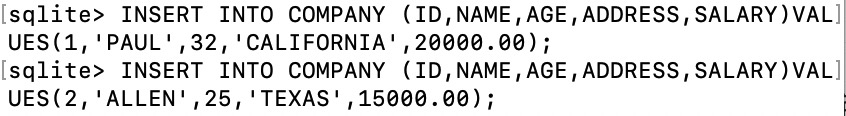

# SQLite 的安装及简单使用测试

## 安装 SQLite

用于测试的电脑系统是 macOS Catalina，已经预装了 SQLite。打开应用程序“终端”（英文名为 Terminal），输入以下代码进行检验：

```
$ sqlite3
```

结果如下：


SQLite 已成功预装，而SQLite是一个零配置的数据库，直接开始使用即可。

## 简单使用测试

### 基本配置相关命令

| 命令     | 含义                                                         |
| -------- | ------------------------------------------------------------ |
| .show    | 显示格式的配置情况                                           |
| .mode    | 设置输出模式，[有五个可选值](https://www.runoob.com/sqlite/sqlite-commands.html) |
| .headers | 显示表格字段名，需要在 mode 值为 column 才有用               |
| .schema  | 查看数据表的模式                                             |

.show 命令运行结果


利用 .mode 和 .headers 命令更改配置并查看


使用 .schema 命令得到表的完整信息


### 创建数据库

SQLite3 创建数据库基本命令如下

```
$sqlite3 DatabaseName.db
```

查看数据库列表命令如下

```
.databases
```

测试结果


### 创建及删除数据表

SQLite3 创建数据表的基本语句和语法如下

```
CREATE TABLE database_name.table_name(
   column1 datatype  PRIMARY KEY(one or more columns),
   column2 datatype,
   column3 datatype,
   .....
   columnN datatype,
);
```

SQLite3 删除数据表的基本语句和语法如下

```
DROP TABLE database_name.table_name;
```

查看数据表命令如下

```
.tables
```

实例测试

1. 创建数据表


2. 删除数据表

   


### 添加记录

在 SQLite 中，利用 INSERT INTO 语句向数据库的某一表中添加新的记录（新行）。

INSERT INTO 语句有两种基本语法，一种是不指定插入的表的列的名称：

```
INSERT INTO TABLE_NAME VALUES (value1,value2,value3,...valueN);
```

另一种是通过规定 column 的值来指定插入的表的列的名称：

```
INSERT INTO TABLE_NAME [(column1, column2, column3,...columnN)]  
VALUES (value1, value2, value3,...valueN);
```

实例测试



### 查询记录

在 SQLite 中，利用 SELECT 语句从 SQLite 数据库表中查询记录、获取数据，以结果表的形式返回数据。

SELECT 语句的基本语法如下：

```
SELECT column1, column2, columnN FROM table_name;
```

column1, column2...是表的字段，可以用 * 来代表所有字段，如下：

```
SELECT * FROM table_name;
```

实例测试


### 删除记录

在 SQLite 中，DELETE 语句用于删除表中已有的记录，可以使用带有 WHERE 子句的 DELETE 查询来删除选定行。基本语法如下：

```
DELETE FROM table_name
WHERE [condition];
```

实例测试


### 修改记录

在 SQLite 中，UPDATE 语句用于修改表中已有的记录，可以使用带有 WHERE 子句的 UPDATE 查询来更新选定行。基本语法如下：

```
UPDATE table_name
SET column1 = value1, column2 = value2...., columnN = valueN
WHERE [condition];
```

实例测试

