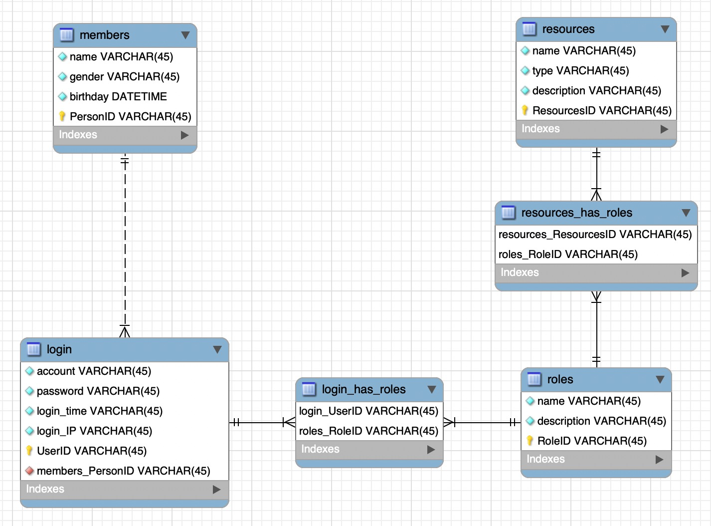

# Lecture 2 课后作业

## 题目一

### 1. 什么是正向工程？什么是逆向工程？

- 正向工程

  正向工程是指通过使用某些数据库管理软件，先画出类似概念数据库模型（CDM），再生成物理数据库模型（PDM），最后利用 PDM 生成对应的 SQL 代码语句的过程。CDM 类似 E-R 图，但在 E-R 图的基础上增加了 Association，Inheritance 两种实体关系，生成 PDM 则相当于建好了数据库的各个表和表中的字段。

- 逆向工程

  顾名思义，逆向工程就是逆向实现正向工程，即先写好 SQL 建库建表语句，然后通过利用数据库管理软件运行相应的 SQL 脚本，生产 PDM，最后可以查看整个数据库的 CDM。

### 2. 列举聚集、弱实体、细化/泛化的实用例子

- 聚集

  负责采购的职工与某一供应商联系，采购所需零件

- 弱实体

  假如有一家翻译公司在接翻译项目的时候，需要先录入订单，再创建项目。“订单”实体负责存储客户信息和财务信息等数据，“项目”实体负责存储项目进度等数据，那么“项目”就是一个弱实体，需要依赖于“订单”实体而存在。

- 细化

  员工可以分为“正式职工”和“实习生”

- 泛化

  在学校中，“老师”和“行政管理人员”同属“职工”

### 3. 关系模式转 E-R 图

## 题目二

其中，teachers.title 的值为1时代表讲师，2为副教授，3为教授，students.degree 的值为1时代表本科生，2为研究生。

## 题目三

- 图一

  

- 图二

  

- 图三

  

- 图四

  